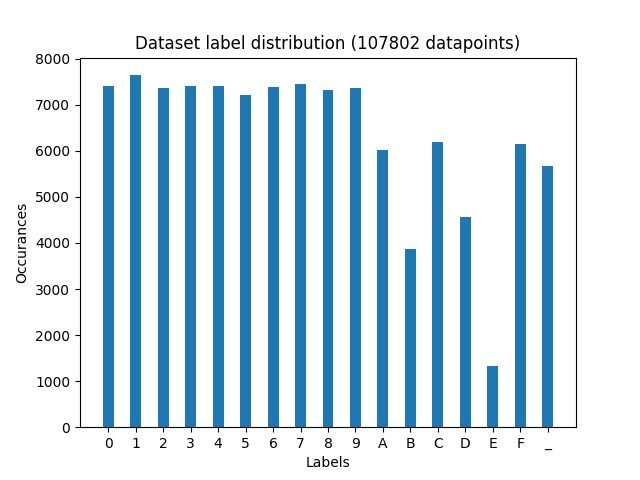
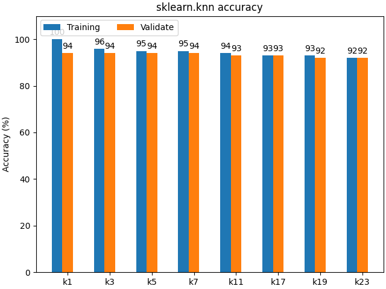
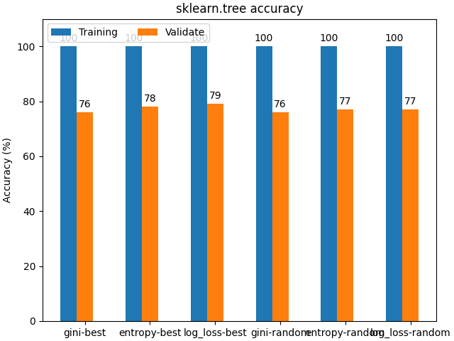
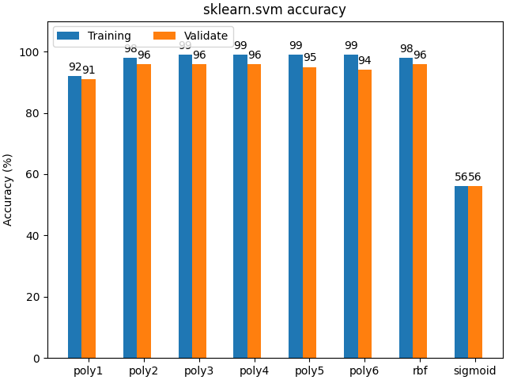
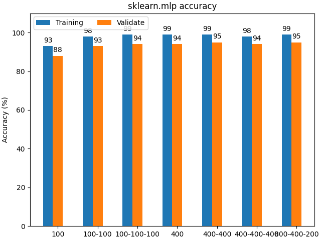
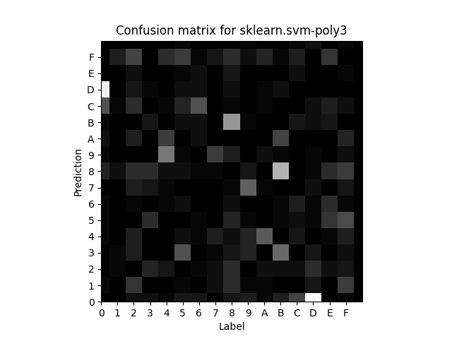
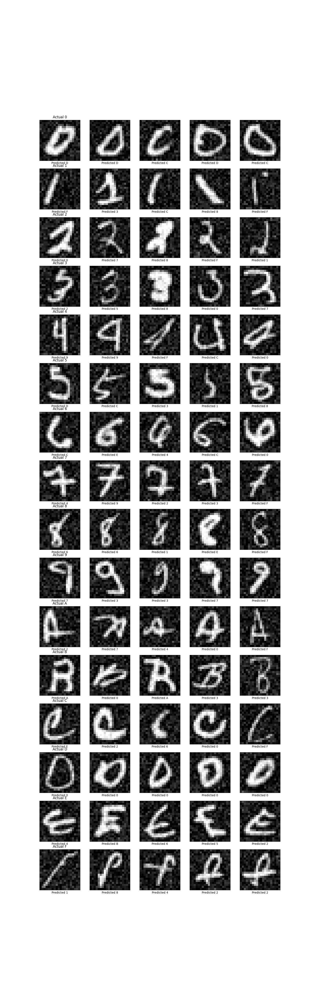

# INF264 Project 2
Language: **Python**  
Group: **Project 2-1**  
Students:  
- Mats Omland Dyrøy (**mdy020**)
- Linus Krystad Raaen (**zec018**)

## Summary

The Chief Elf Officer (CEO) of Santa's Workshop have reached out to us for help sorting gifts.  
All the gifts are marked with a handwritten digit 0-9, A-F.  
Our task was to train a machine learning model to identify these digits that the CEO could then use.  
  
We estimate the accuracy of our final model to be `96%` on data it has never seen before.  
Naturally, a child not getting their present is unacceptable for Santa, and thus our model is not good enough for its intended purpose.

## Run program
If you want to run the program yourself, do the following:

1. Ensure current working directory is the root of this project.
2. Start `code/main.py`.

Logs and images will be created in `dump/<today>/`.  

**NOTE:** The program takes around `2 hours` to run.  
For the convenience of the person grading this assignment, we have already run the program multiple times. 

## Technical report
In this section we will discuss the following topics.

* [Data observations](#data-observations)
* [Model selection](#model-selection)
* [Model candidates](#model-candidates)
* [Final classifier](#final-classifier)
* [Future improvements](#future-improvements)
 
The report is based on the files in `dump/report/` which is a copy of `dump/2023-10-13-1441/`.  
The time estimates will vary from computer to computer and sometimes from run to run.  

### Data observations
Before choosing models and hyper-parameters, we need to look at the dataset we are trying to generalize into knowledge. 
  
  
*(Figure 1-1: Label distribution)*  
Initially we expected to se a uniform dataset, but it appears the `E`, `B` and `D` labels are significantly underrepresented.  
This might impact model performance, but out final model `sklearn.svm-poly3` does not seem to take issue with labelling `E`.  

The following image is very long and includes an example of all the different possible labels.  
We immidiatly notice that the images are very noisy, but to avoid overfitting and to make our models more resilient to small changes, we decided not to remove the noise.  
  
*(Figure 1-2, Label examples)*

### Model selection
* Data split
* How to measure best model
* Selection process
* Test on training to detect overfitting

### Model candidates
We decided to try four different types of models:
* [K-Nearest Neighbor](#k-nearest-neighbor)
* [Decision Tree](#decision-tree)
* [Support Vector Machine](#support-vector-machine)
* [Multi-layer perception](#multi-layer-perception)  

All the model implementations are from `sklearn` and were trained with various hyper-parameters.

#### K-Nearest Neighbor
*(Code: `code/model_trainers/sklearn_knn.py`)*  

For the K-nearest neighbor models, we only varied the value of `k`.  
Spesifically we tried `1`, `3`, `5`, `7`, `11`, `17`, `19` and `23`. After `23` we noticed a worsening trend, so we stopped there.  
To out surprise, `k=1` performed very well. It reached an accuracy of `94%`. (*If you look at out other runs, it usually lands between `94%` and `95%`*)  
It usually spent abount `1.2ms` per prediction.

Here is the accuracy of the `knn` models:  
  
It also seems the `knn` models did not overfit due to the low difference between training and validation accuracy.

#### Decision Tree
*(Code: `code/model_trainers/sklearn_tree.py`)*  

For the decition tree models, we varied the impurity measure (`gini`, `entropy` and `log_loss`) and feature selection (`random` and `best`).  
We could probably have done more work here, but the models were so bad we decided to focus on other classifiers.  
Although the performed badly, it at least did so very fast (Spending around `1000ns` or `0.001ms` per prediction).  

Here is the accuracy of the `decition tree` models:  
  
  
We originally planned to use our own decision tree classifier from `project 1`, but it was incredibly slow and very inaccurate (less than `30%` at best), so we decided to use the sklearn instead. As to why it was so much more inaccurate we aren't fully sure, but it could have to do with more labels in this dataset.  

#### Support Vector Machine
*(Code: `code/model_trainers/sklearn_svm.py`)*  

For the `svm` models, we decided to try different kernels (`poly`, `rbf` and `sigmoid`) and degrees (`1`-`6`).  
The `linear` kernel was too slow in training to be included. We let it run for `12 hours` on a reasonably fast computer, but when it still would not finish, we decided to persue the other parameters instead.  
In the end, we experienced the best accuracy when using an `svm` with kernel set to `poly` and degree set to `3`.  
The accuracy was `96%` and it spent around `3ms` per prediction.  
This ended up being our [final classifier](#final-classifier), and we go into more details in [here](#final-classifier).

Here is the accuracy of the `svm` models:  

#### Multi-layer Perception
*(Code: `code/model_trainers/sklearn_mlp.py`)*  

On multi-payer perception, we decided only to vary the size and number of hidden layers.  
This was mostly because we did not understand the difference and consequence of the different activation functions.  
The best `mlp` model reached an accuracy of `95%`. The timer per prediction (`TPP` in the logs) varied greatly by how many hidden layers there were, but always less than `20 000ns` or `0.02ms`.

Here is the accuracy of the `mlp` models:  
  
*Left to right: `100`, `100-100`, `100-100-100`, `400`, `400-400`, `400-400-400` and `800-400-200`.*  

The model name indicate the size of the hiden layers.  

### Final classifier
The final classifier was `sklearn.svm-poly3`.  
An `svm` classifier from `sklearn` with a `poly` kernel of degree `3`. It reached an accuracy of `96%` and spends `3.2ms` per prediction.  

We decided to take a look at the `4%` that went wrong.  
Here is the confusion matrix:  
  
The bright squares indicate a higher error rate.  
We initially expected the error rate for `E` to be higher due to its lower representation in the dataset, but it appears to be just fine.  
The two primary confusions are `D`-`0` and `B`-`8`.  
To understand these errors better, we compiled a list of 5 examples of each label that the model got wrong:  
  
We find some of these errors to be completely understandable (and we would have struggled to identify them ourself), and others to be not so much.

### Future improvements
We could take a deeper look into the different activation functions for MLP and see if they offer any improvements, but that might prove fruitless.

We could also see if we are able to speed up the training/testing as it at the moment takes quite a while on even a fast computer